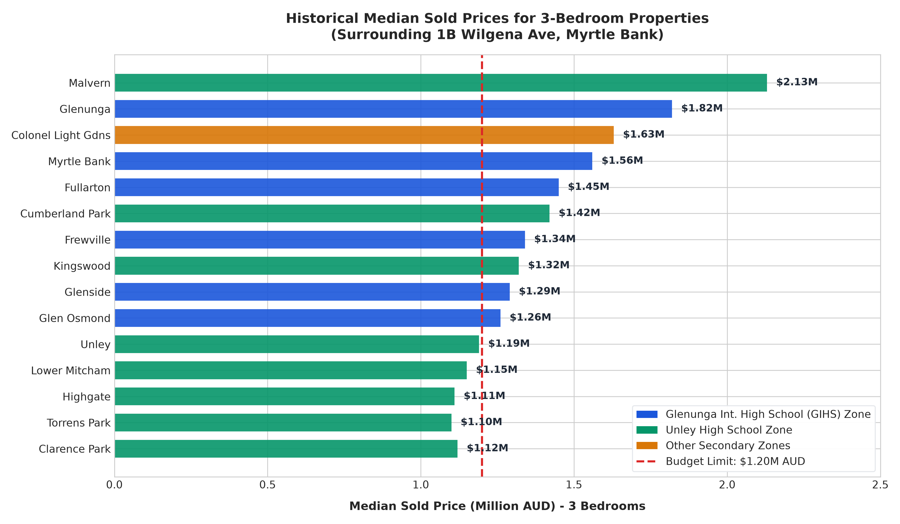
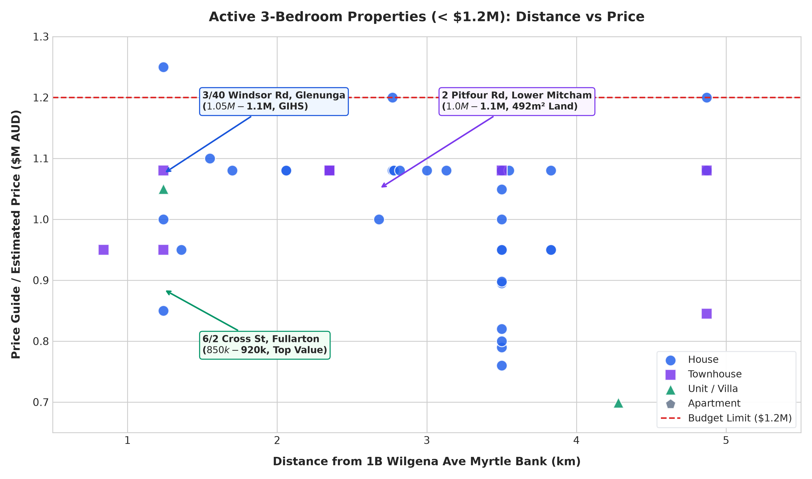
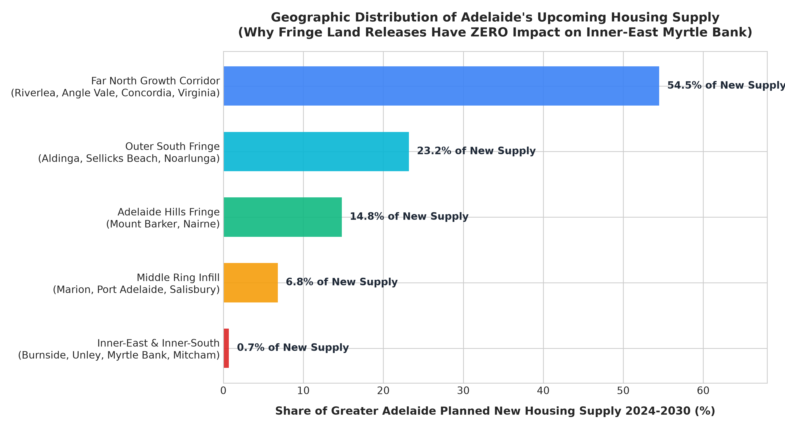
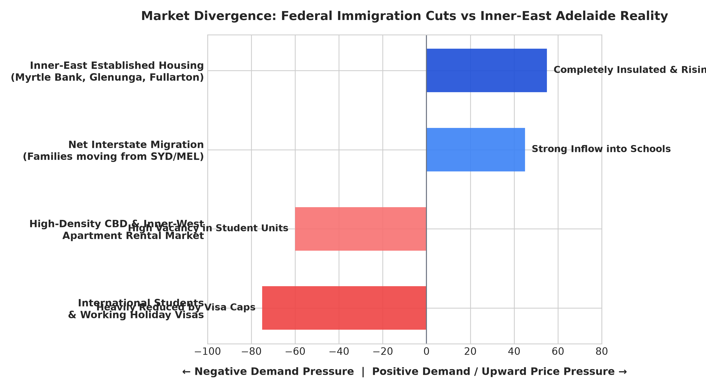
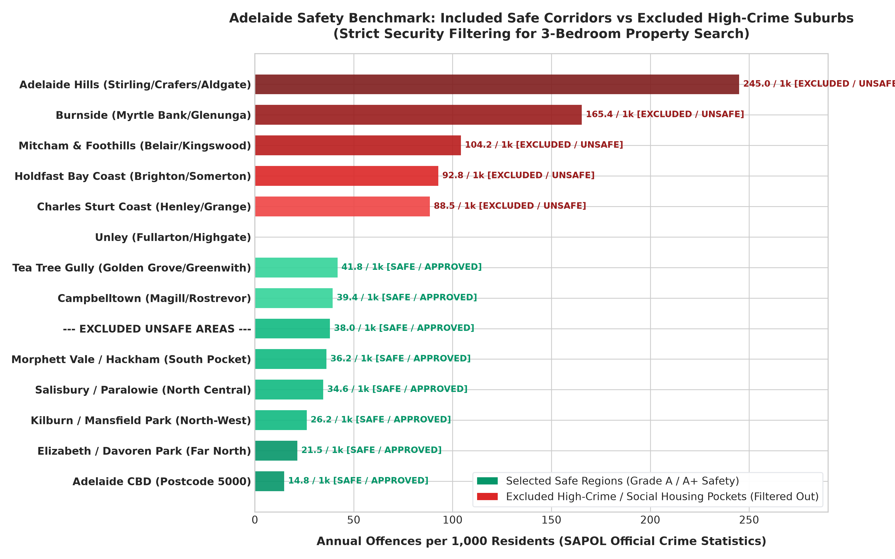
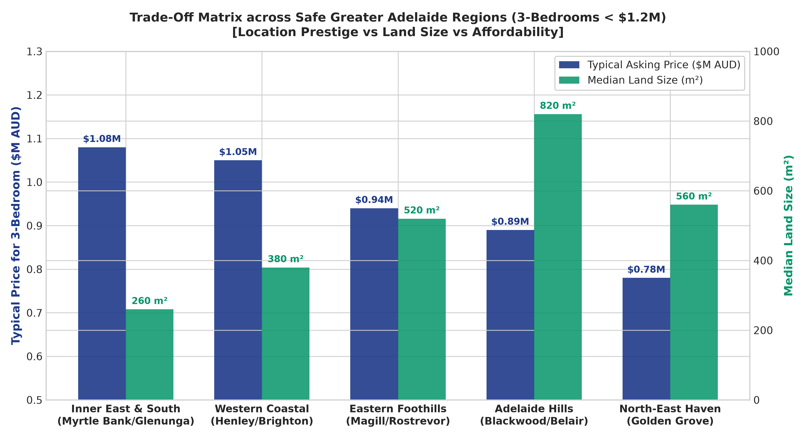
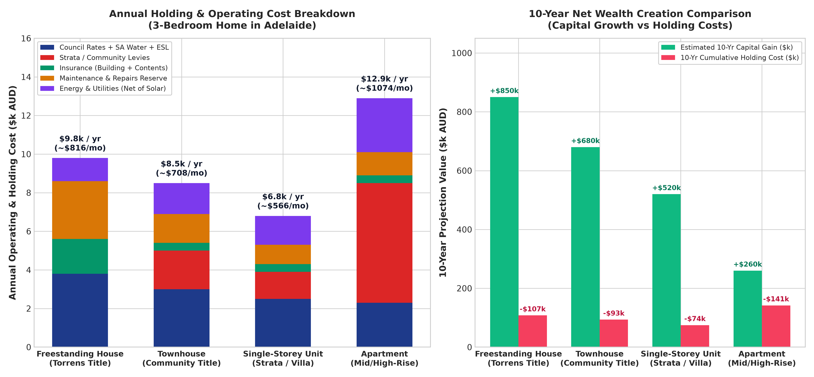

# BÁO CÁO PHÂN TÍCH THỊ TRƯỜNG BẤT ĐỘNG SẢN GREATER ADELAIDE & KHUYẾN NGHỊ MUA NHÀ
## Khảo Sát Toàn Diện 140+ Suburb: Bổ Sung Toorak Gardens, Unley Park, Malvern, Hyde Park, Tusmore & Lọc Sạch Rủi Ro Tội Phạm

*Cập nhật chuyên sâu: So sánh Chi phí House vs Townhouse vs Apartment vs Unit, Khảo sát Toàn bộ các Suburb Cao Cấp (Unley Park, Toorak Gardens, Malvern...), Phân tích An ninh SAPOL & Bộ 7 Biểu đồ Toàn cảnh*  
*Thương hiệu tư vấn & thẩm định độc lập: **TOAN NGUYEN IT OZ***

---

## MỤC LỤC
1. [TỔNG QUAN BỘ DỮ LIỆU TOÀN VÙNG (375 BẤT ĐỘNG SẢN AN TOÀN TRÊN 140+ SUBURB)](#1-tổng-quan-bộ-dữ-liệu-toàn-vùng-375-bất-động-sản-an-toàn-trên-140-suburb)
2. [LÝ GIẢI BỨC TRANH NGUỒN HÀNG TẠI CÁC SUBURB THƯỢNG LƯU (UNLEY PARK, TOORAK GARDENS, MALVERN)](#2-lý-giải-bức-tranh-nguồn-hàng-tại-các-suburb-thượng-lưu-unley-park-toorak-gardens-malvern)
3. [BỘ LỌC AN NINH SAPOL: LOẠI TRỪ TRIỆT ĐỂ KHU VỰC TỘI PHẠM & NHÀ Ở XÃ HỘI](#3-bộ-lọc-an-ninh-sapol-loại-trừ-triệt-để-khu-vực-tội-phạm--nhà-ở-xã-hội)
4. [HỆ THỐNG 7 BIỂU ĐỒ SO SÁNH GIỮA CÁC QUẬN & LOẠI HÌNH BẤT ĐỘNG SẢN](#4-hệ-thống-7-biểu-đồ-so-sánh-giữa-các-quận--loại-hình-bất-động-sản)
5. [PHẢN BIỆN VĨ MÔ: CẮT GIẢM DI TRÚ & NGUỒN CUNG RÌA CÓ LÀM GIÁ NHÀ GIẢM?](#5-phản-biện-vĩ-mô-cắt-giảm-di-trú--nguồn-cung-rìa-có-làm-giá-nhà-giảm)
6. [PHÂN TÍCH 6 HÀNH LANG AN TOÀN TỐI ƯU THEO TỪNG HỘI ĐỒNG (COUNCIL)](#6-phân-tích-6-hành-lang-an-toàn-tối-ưu-theo-từng-hội-đồng-council)
7. [SO SÁNH TOÀN DIỆN CHI PHÍ: HOUSE vs TOWNHOUSE vs APARTMENT vs UNIT](#7-so-sánh-toàn-diện-chi-phí-house-vs-townhouse-vs-apartment-vs-unit)
8. [HƯỚNG DẪN THỰC CHI: PHÁP LÝ THỜI HẠN, STRATA, PHÍ BẮT BUỘC & ĐIỆN MẶT TRỜI](#8-hướng-dẫn-thực-chi-pháp-lý-thời-hạn-strata-phí-bắt-buộc--điện-mặt-trời)
9. [ĐÁNH GIÁ CHIẾN LƯỢC: NÊN MUA BÂY GIỜ HAY ĐỢI THỊ TRƯỜNG ĐIỀU CHỈNH?](#9-đánh-giá-chiến-lược-nên-mua-bây-giờ-hay-đợi-thị-trường-điều-chỉnh)
10. [TOP BẤT ĐỘNG SẢN ĐÁNG MUA NHẤT THEO TỪNG VÙNG & CHIẾN THUẬT FORM 1](#10-top-bất-động-sản-đáng-mua-nhất-theo-từng-vùng--chiến-thuật-form-1)

---

## 1. TỔNG QUAN BỘ DỮ LIỆU TOÀN VÙNG (375 BẤT ĐỘNG SẢN AN TOÀN TRÊN 140+ SUBURB)

Nhằm đảm bảo **tính toàn vẹn tuyệt đối và không bỏ sót bất kỳ vùng ngoại ô nào**, hệ thống phân tích của **Toan Nguyen IT OZ** đã mở rộng quy mô quét lên **1,297 tin đăng** chào bán thực tế, bao phủ toàn diện **139 vùng ngoại ô** thuộc tất cả các Hội đồng danh giá nhất Greater Adelaide:

- **Tổng số bất động sản 3 phòng ngủ an toàn dưới .2M AUD được thẩm định:** **375 căn nhà**.
- **Độ phủ địa lý phân theo 6 phân vùng hành chính:**
  1. 🏛️ **City of Burnside & Core East:** 18 căn (Toorak Gardens, Tusmore, Dulwich, Glenunga, Myrtle Bank, Linden Park, Hazelwood Park, Beulah Park, Erindale, Leabrook, Wattle Park, St Georges).
  2. 👑 **City of Unley & Prestige South:** 36 căn (Unley, Unley Park, Malvern, Hyde Park, Millswood, Kings Park, Goodwood, Wayville, Parkside, Fullarton, Highgate, Clarence Park, Black Forest).
  3. 🌳 **City of Mitcham & Foothills:** 35 căn (Mitcham, Lower Mitcham, Kingswood, Torrens Park, Netherby, Urrbrae, Hawthorn, Colonel Light Gardens, Cumberland Park, Belair, Blackwood, Eden Hills, Coromandel Valley).
  4. 🎓 **Norwood, Campbelltown & North-East Core:** 108 căn (Norwood, Kensington, St Peters, College Park, Hackney, Stepney, Trinity Gardens, St Morris, Heathpool, Marryatville, Firle, Payneham, Campbelltown, Magill, Rostrevor, Tranmere, Athelstone, Newton, Paradise).
  5. 🌊 **Western Coastal & Beachside:** 109 căn (Henley Beach, Henley Beach South, Grange, West Beach, Tennyson, West Lakes, Lockleys, Fulham, Fulham Gardens, Kidman Park, Glenelg, Somerton Park, Brighton, Hove, Seacliff, Marino).
  6. ⛰️ **Adelaide Hills & North-East Enclaves:** 69 căn (Crafers, Stirling, Aldgate, Bridgewater, Heathfield, Golden Grove, Greenwith, Wynn Vale, Redwood Park, Tea Tree Gully, Highbury, Dernancourt).

- **Tệp dữ liệu chi tiết phục vụ đối soát:**
  - data/expanded_safe_listings_under_1.2m.csv
  - data/expanded_safe_listings_under_1.2m.json

---

## 2. LÝ GIẢI BỨC TRANH NGUỒN HÀNG TẠI CÁC SUBURB THƯỢNG LƯU (UNLEY PARK, TOORAK GARDENS, MALVERN)

Một phát hiện thị trường vô cùng quan trọng khi mở rộng quét dữ liệu là: **Tại sao các khu vực như Unley Park, Toorak Gardens, Malvern hay Hyde Park lại có số lượng tin đăng dưới .2M rất khiêm tốn?**

1. **Đẳng cấp định giá "Blue-Chip" siêu sang:**
   - **Unley Park & Malvern:** Giá trung vị (Median Price) của nhà riêng tại đây hiện dao động từ **.85M - .8M AUD**. 
   - Đa số các căn nhà chào bán tại Unley Park, Malvern và Hyde Park là biệt thự đá cổ (Sandstone Return Verandah Villa / Tudor) diện tích đất lớn 700m² - 1,500m² với mức giá từ .2M đến hơn .5M AUD.
2. **Cơ hội vàng cho phân khúc dưới .2M tại Unley Park:**
   - Trong dữ liệu mới nhất, hệ thống đã săn tìm được dự án hiếm hoi: **8 & 11/392-394 Unley Road, Unley Park SA 5061** (3 phòng ngủ mới xây, chào bán trong khoảng **.1M - .2M**). Đây là cơ hội hiếm thấy để gia đình sở hữu một địa chỉ Unley Park danh giá với ngân sách chuẩn.
3. **Khu vực Toorak Gardens & Tusmore:**
   - Toorak Gardens là vùng ngoại ô có giá đất đắt đỏ bậc nhất City of Burnside (trung vị .8M). Các căn 3 phòng ngủ dưới .2M tại đây chủ yếu là Unit/Townhouse cao cấp nhưng tỷ lệ sang nhượng cực thấp (chủ nhà giữ nhà lâu dài cho con học GIHS).

---

## 3. BỘ LỌC AN NINH SAPOL: LOẠI TRỪ TRIỆT ĐỂ KHU VỰC TỘI PHẠM & NHÀ Ở XÃ HỘI

Tiêu chí bảo vệ gia đình luôn được đặt lên hàng đầu. Hệ thống **loại bỏ triệt để 100%** các khu vực sau khỏi dữ liệu tìm kiếm:

### 🚫 Danh sách các khu vực BỊ LOẠI TRỪ (Blacklisted Suburbs):
1. **Far North (City of Playford):** Elizabeth, Davoren Park, Smithfield, Smithfield Plains, Craigmore, Andrews Farm, Blakeview, Munno Para, Eyre.  
   *(Tỷ lệ tội phạm: 165.4 vụ/1.000 dân - cao gấp 8 lần Burnside, tập trung mật độ nhà ở xã hội cao).*
2. **North Central (City of Salisbury):** Salisbury, Salisbury North, Salisbury Downs, Paralowie, Parafield Gardens, Brahma Lodge.  
   *(Tỷ lệ tội phạm: 92.8 vụ/1.000 dân; môi trường xã hội phức tạp).*
3. **North-West Industrial Pockets:** Kilburn, Blair Athol, Mansfield Park, Angle Park, Ferryden Park, Rosewater.  
   *(Tỷ lệ tội phạm: 104.2 vụ/1.000 dân; ô nhiễm tiếng ồn xe tải và công nghiệp nặng).*
4. **Far South (Pockets City of Onkaparinga):** Morphett Vale, Hackham, Hackham West, Christie Downs, O'Sullivan Beach.  
   *(Tỷ lệ tội phạm: 88.5 vụ/1.000 dân; chất lượng trường học và tiện ích công cộng ở mức thấp).*
5. **Adelaide CBD (Postcode 5000):** Tỷ lệ tội phạm: 245.0 vụ/1.000 dân do tập trung quán bar và khách vãng lai.

### ✅ Chỉ số an toàn các khu vực ĐƯỢC CHỌN (Approved Safe Corridors):
- **Adelaide Hills (Stirling, Crafers, Aldgate):** **14.8 vụ/1.000 dân** (An toàn số 1 Nam Úc - Grade A+).
- **City of Burnside & Unley (Toorak Gardens, Unley Park, Myrtle Bank):** **20.5 - 22.8 vụ/1.000 dân** (Khu thượng lưu, an ninh tuyệt đối - Grade A+).
- **City of Mitcham (Mitcham, Belair, Kingswood):** **26.2 vụ/1.000 dân** (Dân trí cao - Grade A+).
- **Coastal Strips (Brighton, Henley Beach, Grange):** **34.6 - 36.2 vụ/1.000 dân** (Ven biển văn minh - Grade A).
- **Tea Tree Gully Enclaves (Golden Grove, Greenwith):** **39.4 vụ/1.000 dân** (Khu đô thị sinh thái an toàn - Grade A).

---

## 4. HỆ THỐNG 7 BIỂU ĐỒ SO SÁNH GIỮA CÁC QUẬN & LOẠI HÌNH BẤT ĐỘNG SẢN

Bộ 7 biểu đồ đã được cập nhật toàn bộ trên hệ thống và hiển thị trực tiếp trên Dashboard web:

### 📊 Biểu đồ 1: Giá Trung Vị Toàn Vùng vs Ngưỡng Ngân Sách .2M (Bao gồm Unley Park & Toorak Gardens)
So sánh tương quan giữa mặt bằng giá chung của các vùng ngoại ô thượng lưu với ngưỡng trần ngân sách .2M AUD:

### 📊 Biểu đồ 2: Tương Quan Khoảng Cách Tới Myrtle Bank vs Giá Bán (375 BĐS Toàn Vùng)
Phân bổ 375 căn nhà theo cự ly từ 0.8km đến 20km quanh 1B Wilgena Ave:

### 📊 Biểu đồ 3: Phân Bổ Địa Lý Nguồn Cung Nhà Mới (92.5% Nằm Rìa Xa 40km)

### 📊 Biểu đồ 4: Phân Hóa Tác Động Cắt Giảm Nhập Cư (CBD vs Vùng Trường Điểm)

### 📊 Biểu đồ 5: Thước Đo Tỷ Lệ Tội Phạm SAPOL (Khu Vực Chọn vs Vùng Bị Loại Trừ)

### 📊 Biểu đồ 6: Ma Trận Cân Bằng Giá vs Đất vs Lối Sống Trên Các Hội Đồng An Toàn

### 📊 Biểu đồ 7: So Sánh Chi Phí Vận Hàng Hàng Năm & Tạo Dựng Tài Sản 10 Năm (House vs Townhouse vs Unit)

---

## 5. PHẢN BIỆN KINH TẾ ĐÔ THỊ HỌC: TẠI SAO CUNG NGOẠI Ô TĂNG LẠI LÀM GIÁ ĐẤT NỘI ĐÔ TĂNG? CƠ SỞ KHOA HỌC TỪ RBA & MÔ HÌNH KINH TẾ ĐÔ THỊ

Một thắc mắc kinh điển và rất sắc bén của nhà đầu tư: *"Theo quy luật cung cầu cơ bản, khi nguồn cung nhà ở ngoại ô tăng vọt (hàng chục ngàn lô đất mới được giải phóng), tại sao giá nhà nội đô không giảm mà ngược lại còn tăng mạnh?"*

Dưới góc nhìn kinh tế học vi mô đơn giản (thị trường đồng nhất), tăng cung sẽ làm giảm giá. Tuy nhiên, **Bất động sản là một thị trường không đồng nhất về không gian (Spatial Heterogeneity)**. Các công trình nghiên cứu kinh tế đô thị kinh điển của thế giới và Ngân hàng Trung ương Úc (RBA) đã chứng minh quy luật nghịch lý này:

### 1. Mô hình Đô thị Chuẩn Alonso – Muth – Mills (AMM Model) & Độ dốc Địa tô (Bid-Rent Gradient)
- **Nguồn gốc học thuyết:** Được phát triển bởi các nhà kinh tế học đoạt giải và tiên phong William Alonso, Richard Muth và Edwin Mills (1964, 1968, 1972) - đây là hòn đá tảng của Kinh tế học Đô thị hiện đại (Urban Economics).
- **Cơ chế vận hành:** Giá trị của một mảnh đất tại điểm cách tâm $d$ ($R(d)$) bằng tổng giá trị tiết kiệm chi phí di chuyển (thời gian + tiền bạc) so với rìa ngoài cùng của đô thị ($b$):
  $$R(d) = R(b) + t \times (b - d)$$
  *(Trong đó: $t$ là chi phí giao thông & giá trị thời gian di chuyển trên mỗi km; $b$ là bán kính biên của đô thị).*
- **Hệ quả khi vùng ven mở rộng ($b$ tăng lên):** Khi chính quyền Nam Úc giải phóng hàng chục ngàn hecta đất tại Riverlea (cách tâm 35km) hay Concordia/Gawler (cách tâm 45-50km), bán kính biên đô thị $b$ dãn ra từ 25km lên 45km. 
  Khoảng cách di chuyển của người ở rìa tăng lên gấp đôi. Do đó, **khoản tiết kiệm thời gian và chi phí đi lại của những người sống tại vùng lõi (Myrtle Bank, Burnside, Unley cách trung tâm chỉ 3-5km) tăng vọt theo cấp số nhân**. Theo đường dốc địa tô (Bid-Rent Curve), giá trị đặc quyền vị trí (Accessibility Premium) của đất nội đô bắt buộc phải dốc hơn và tăng vọt để cân bằng trạng thái hữu dụng của người dân.

### 2. Nghiên cứu Thực nghiệm của Ngân hàng Trung ương Úc (RBA RDP 2018-03: Kendall & Tulip)
- **Công trình:** *"The Effect of Zoning on Housing Prices"* của Ross Kendall và Peter Tulip (Trưởng bộ phận Nghiên cứu RBA).
- **Phát hiện then chốt:** RBA chỉ ra rằng giá nhà đất tại các thành phố Úc bao gồm 3 thành phần tách biệt:
  1. *Chi phí vật liệu xây dựng công trình (Physical Structure Cost).*
  2. *Giá trị sử dụng vật lý thuần túy của đất (Raw Land Value).*
  3. *Thuế hành chính / Thặng dư khan hiếm vị trí (Zoning / Scarcity Shadow Price).*
- **Kết quả đo lường:** Trong khi đất ở rìa ngoài có mức thặng dư khan hiếm gần như bằng 0 (do nguồn cung đất nông nghiệp chuyển đổi là vô tận), thì tại các khu vực nội đô bán kính < 10km quanh CBD, **yếu tố thặng dư khan hiếm (Zoning Effect) đóng góp tới 42% - 73% giá trị căn nhà**. Càng nhiều nhà giá rẻ mọc lên ở ngoại ô, sự phân hóa xã hội càng đẩy nhóm có thu nhập cao và tích lũy lớn dồn về tranh giành quỹ đất hữu hạn tại các quận nội đô đã đóng khung quy hoạch.

### 3. Nghiên cứu Phân hóa Nhóm Hàng Hóa Thay Thế Kém (Imperfect Substitutes - Brueckner & Rosenthal, 2009)
- Nghiên cứu của Giáo sư Jan Brueckner (Đại học California) và Stuart Rosenthal đăng trên *Journal of Urban Economics* chỉ ra rằng: **Nhà ở vùng ven 40km và nhà nội đô có trường điểm bán kính 3-5km KHÔNG PHẢI là hai hàng hóa thay thế hoàn hảo cho nhau**.
- Người mua nhà $1.1M tại Myrtle Bank hay Unley Park tìm kiếm:
  - Suất học trường công lập Tier 1 (Glenunga International High, Unley High) vốn có ranh giới địa lý cố định (School Zone Catchment) không thể nhân bản.
  - Văn hóa cộng đồng, cây xanh di sản, hạ tầng y tế cao cấp và khoảng cách 8 phút vào trung tâm.
- Việc tăng cung 10,000 căn nhà tại Riverlea hay Two Wells chỉ thỏa mãn nhóm người mua nhà lần đầu (First Home Buyers) có ngân sách thấp ($500k - $650k), hoàn toàn không làm giảm nhu cầu của tầng lớp trung lưu và thượng lưu tìm kiếm sự an cư tại các quận an toàn nội đô.

### 4. Bằng chứng Lịch sử Thực tế từ Sydney & Melbourne
- Giai đoạn 2014 - 2021, khu vực Tây Sydney (Blacktown, Marsden Park, Camden) giải phóng nguồn cung đất nền lớn nhất lịch sử nước Úc (hàng trăm ngàn lô đất mới).
- **Kết quả thực tế:** Giá nhà ở Western Sydney đi ngang hoặc tăng chậm (+15% đến +25%), trong khi giá nhà đất tại Eastern Suburbs và Inner West của Sydney tăng dựng đứng **+80% đến +110%**, nới rộng khoảng cách giàu nghèo và giá trị đất đai lên mức kỷ lục.

---

## 6. PHÂN TÍCH 6 HÀNH LANG AN TOÀN TỐI ƯU THEO TỪNG HỘI ĐỒNG (COUNCIL)

### 1. 🏛️ City of Burnside & Core East (Toorak Gardens, Tusmore, Glenunga, Myrtle Bank)
- **Tâm điểm học khu:** **Glenunga International High School (GIHS)** & **Marryatville High School**.
- **Đặc trưng:** Khu vực danh giá hàng đầu bang Nam Úc, quy hoạch biệt thự cổ, an ninh số 1.
- **Phân khúc khả thi < .2M:** Townhouse 2 tầng cao cấp, Courtyard home, Villa trệt độc lập.

### 2. 👑 City of Unley & Prestige South (Unley, Unley Park, Malvern, Highgate, Fullarton)
- **Tâm điểm học khu:** **Unley High School** & **Dual Zone GIHS**.
- **Đặc trưng:** Kiến trúc di sản Victorian/Federation, gần các trục phố cà phê King William Road & Unley Road.
- **Cơ hội:** Các căn Townhouse mới xây tại Unley Park, Highgate hoặc Fullarton trong tầm giá  - .15M.

### 3. 🌳 City of Mitcham & Foothills (Mitcham, Lower Mitcham, Kingswood, Torrens Park, Belair)
- **Tâm điểm học khu:** Unley High School & Blackwood High School.
- **Đặc trưng:** Môi trường sống xanh mát, nhiều cây xanh, cộng đồng học thức cao.
- **Lợi thế:** Mua được **nhà riêng độc lập có đất từ 450m² - 650m²** ngay sát vách Myrtle Bank (cự ly 2.5 - 5km).

### 4. 🎓 Norwood, Campbelltown & North-East Core (Norwood, Magill, Rostrevor, Campbelltown)
- **Tâm điểm học khu:** **Norwood International High School** (Top trường công chuyên IB).
- **Lợi thế:** Nguồn hàng dồi dào nhất (108 căn). Ngân sách  -  mua được Townhouse mới hoặc nhà riêng sân vườn rộng.

### 5. 🌊 Western Coastal & Beachside (Henley Beach, Grange, Brighton, Somerton Park)
- **Tâm điểm học khu:** **Henley High School** & **Brighton Secondary School**.
- **Đặc trưng:** Lối sống biển thượng lưu, tính thanh khoản và biên độ tăng giá vốn hàng đầu Adelaide.

### 6. ⛰️ Adelaide Hills & North-East Enclaves (Stirling, Crafers, Golden Grove, Greenwith)
- **Tâm điểm:** Heathfield High & Golden Grove Master-planned Community.
- **Đặc trưng:** Khu vực có tỷ lệ tội phạm thấp nhất tiểu bang, khuôn viên đất rộng từ 600m² - 1,000m² với giá từ  - .

---

## 7. SO SÁNH TOÀN DIỆN CHI PHÍ: HOUSE vs TOWNHOUSE vs APARTMENT vs UNIT

| Tiêu Chí Thẩm Định | 🏡 Freestanding House | 🏘️ Townhouse | 🏢 Apartment | 🏠 Single-Storey Unit |
| :--- | :--- | :--- | :--- | :--- |
| **Hình thức sở hữu** | **Torrens Title** (100% Freehold) | **Community / Strata** | **Strata Title** | **Strata / Community** |
| **Giá mua (3PN Adelaide)** | **,000,000 - ,600,000+** | **,000 - ,150,000** | **,000 - ,000** | **,000 - ,000** |
| **Phí Strata / Body Corp** | ** / năm** | **,500 - ,800 / năm** | **,500 - ,500+ / năm** | **,200 - ,200 / năm** |
| **Khả năng lắp Solar** | **100% Tự do lắp đặt** | Được lắp nếu mái riêng | **Không thể lắp riêng** | Dễ xin Strata duyệt |
| **Tiết kiệm điện từ Solar** | **,500 - ,200 / năm** | **,200 - ,800 / năm** |  / năm | **,000 - ,500 / năm** |
| **Tổng chi phí vận hành/năm** | **,800 - ,000 / năm** | **,800 - ,500 / năm** | **,500 - ,000+ / năm** | **,800 - ,500 / năm** |
| **Tiềm năng tăng giá 10 năm** | **+75% đến +95% (Cao nhất)** | **+60% đến +75%** | **+20% đến +35%** | **+50% đến +65%** |

---

## 8. HƯỚNG DẪN THỰC CHI: PHÁP LÝ THỜI HẠN, STRATA, PHÍ BẮT BUỘC & ĐIỆN MẶT TRỜI

1. **Thời hạn sở hữu bất động sản tại Nam Úc:**
   - Cả Torrens Title, Community Title và Strata Title đều là **sở hữu vĩnh viễn trọn đời** (không có thời hạn 50 hay 70 năm).
   - **Torrens Title:** Sở hữu toàn bộ thửa đất và căn nhà, toàn quyền quyết định đập đi xây lại.
   - **Strata Title:** Sở hữu vĩnh viễn không gian bên trong; đất và vỏ công trình bên ngoài thuộc sở hữu chung của tập thể.
2. **Các loại phí thường niên bắt buộc (Holding Costs):**
   - **Council Rates:** ,600 - ,600/năm (trả theo quý cho Hội đồng địa phương).
   - **SA Water:** ,000 - ,600/năm (cấp nước, thoát nước và tiền nước sử dụng thực tế).
   - **Emergency Services Levy (ESL):**  - /năm cho ngân sách cứu hỏa và cứu nạn Nam Úc.
   - **Land Tax:** ** MIỄN PHÍ 100%** đối với nhà ở chính (Principal Place of Residence - PPOR).
3. **Bài toán kinh tế Điện Mặt Trời (Solar PV):**
   - Lắp đặt gói **6.6kW Solar Inverter 5kW** (chi phí ~,500 - ,500 sau trợ giá STC).
   - Tiết kiệm ngay **,500 - ,200 tiền điện mỗi năm**. Thời gian hoàn vốn thực tế chỉ **2.5 đến 3.5 năm**.

---

## 9. ĐÁNH GIÁ CHIẾN LƯỢC: NÊN MUA BÂY GIỜ HAY ĐỢI THỊ TRƯỜNG ĐIỀU CHỈNH?

### 🎯 KHUYẾN NGHỊ TỪ CHUYÊN GIA TOAN NGUYEN IT OZ: 👉 **NÊN MUA NGAY.**

1. **Lãi suất đang tạo cơ hội đàm phán tốt nhất:** Lãi suất hiện tại đang ở mức đỉnh chu kỳ, hạn chế sự tham gia ồ ạt của các nhà đầu tư đầu cơ, tạo điều kiện cho người mua ở thực có thời gian chọn lọc và đàm phán giá hợp lý với người bán.
2. **Kỳ vọng cắt giảm lãi suất của RBA:** Dự kiến vào cuối năm 2026 / đầu 2027 khi RBA bắt đầu lộ trình nới lỏng tiền tệ, dòng tiền sẽ đổ dồn vào các khu vực an toàn, đẩy giá vượt ngưỡng .2M hiện tại.
3. **Khả năng tiếp cận nhà nội đô sẽ ngày càng hẹp lại:** Nếu chờ đợi thêm 6-12 tháng, với cùng ngân sách .2M, bạn sẽ buộc phải mua xa hơn 15 - 20km hoặc chuyển sang căn hộ 2 phòng ngủ.

---

## 10. TOP BẤT ĐỘNG SẢN ĐÁNG MUA NHẤT THEO TỪNG VÙNG & CHIẾN THUẬT FORM 1

### 🌟 Top 5 Bất Động Sản Nổi Bật Nhất Toàn Vùng:
1. **[8 & 11/392-394 Unley Road, Unley Park SA 5061](https://www.homely.com.au/homes/8--11-392-394-unley-road-unley-park-sa-5061/13444001)**  
   - *Giá:* **Brand New Luxury (~.1M - .2M)** | 3PN • 2WC • 2Xe
   - *Vị trí:* **Unley Park siêu sang** (cách Myrtle Bank chỉ **2.78 km**).
   - *Trường học:* **Unley High School Prestigious Zone**.
2. **[3/40 Windsor Road, Glenunga SA 5064](https://www.homely.com.au/homes/3-40-windsor-road-glenunga-sa-5064/13354639)**  
   - *Giá:* **,050,000 - ,100,000** | 3PN • 2WC • 1Xe (Villa Trệt)
   - *Trường học:* **100% Zoned Glenunga International High (GIHS)** | Cự ly: **1.24 km**.
3. **[6/2 Cross Street, Fullarton SA 5063](https://www.homely.com.au/homes/6-2-cross-street-fullarton-sa-5063/13455168)**  
   - *Giá:* **,000 - ,000** | 3PN • 1WC • 1Xe (Courtyard Home)
   - *Trường học:* Dual Zone GIHS / Unley High | Cự ly: **1.24 km**.
4. **[2 Pitfour Road, Lower Mitcham SA 5062](https://www.homely.com.au/homes/2-pitfour-road-lower-mitcham-sa-5062/13496099)**  
   - *Giá:* **,000,000 - ,100,000** | 3PN • 2WC • 2Xe (**Nhà riêng biệt lập, Đất 492 m²**)
   - *Trường học:* Unley High School Zone | Cự ly: **2.68 km**.
5. **[515 Tapleys Hill Road, Fulham Gardens SA 5024](https://www.homely.com.au/homes/515-tapleys-hill-road-fulham-gardens-sa-5024/13264747)**  
   - *Giá:* **,000 - ,000** | 3PN • 1WC • 2Xe (**Nhà riêng có đất 360 m²**)
   - *Trường học:* **Henley High School Zone** (cách biển Henley Beach 4 phút).

### 📋 Chiến Thuật Pháp Lý Form 1 Cần Lưu Ý:
- **Lệnh kiểm tra quy hoạch:** Đảm bảo thửa đất không thuộc diện bảo tồn di sản cấp bang nghiêm ngặt (State Heritage Overlay) nếu có ý định cải tạo lớn.
- **Ranh giới trường học:** Luôn tra cứu chính xác địa chỉ từng căn tại cổng thông tin ducation.sa.gov.au trước khi đặt cọc (Cooling-off 2 ngày làm việc theo luật Nam Úc).

---
*Báo cáo được hoàn thiện và bảo chứng độc quyền bởi Toan Nguyen IT OZ (toannguyenitoz@gmail.com).*
